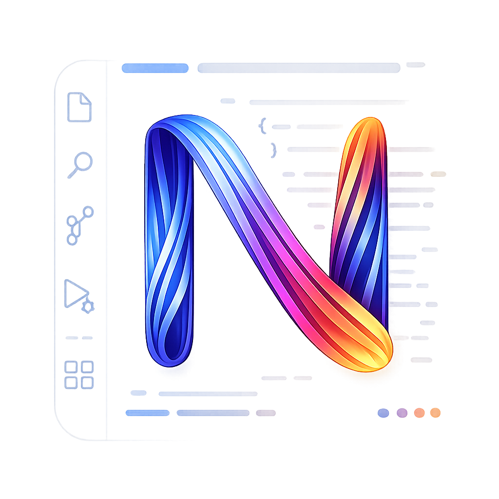

# NexQL Themes

<p align="center">
  
</p>

<p align="center">
  <strong><a href="https://nexql-themes.astrx.dev/">Preview NexQL Themes live</a></strong>
  <strong><a href="https://nexql.astrx.dev/">••• NexQL DB Extension for VS Code</a></strong>
</p>

**NexQL Themes** — a VS Code color-theme family for database work and everyday coding. Eleven scenario-anchored variants (dark, light, OLED, homage) share one design language: quiet keywords, a disciplined cool→warm syntax spectrum, and a single reserved accent for errors.

Install from the [VS Code Marketplace](https://marketplace.visualstudio.com/items?itemName=ric-v.nexql-themes) or [Open VSX](https://open-vsx.org/extension/ric-v/nexql-themes), then `Preferences: Color Theme` → pick any **NexQL** theme.

## Philosophy

The logo — a glowing **N** woven from fiber-optic strands over a dark IDE canvas — encodes how every theme in the family is meant to feel and behave.

### Brand

| Principle | Definition |
| --- | --- |
| **Vibrancy in the dark** | Near-black or warm-paper foundations with energetic, high-contrast syntax color. Reduce eye strain without going gray and lifeless. |
| **Fluid integration** | Intertwined strands stand for SQL, data, and modern application code living in one editor — one coherent visual system across languages and tools. |
| **Energy and flow** | The cool→warm gradient (teal → violet → amber) mirrors scan rhythm: structure first, data last. Color guides the eye without shouting. |
| **Developer-first precision** | Built for the nuances of real coding — brackets, keywords, types, strings, errors — not generic prettiness. Every hue earns its place in the hierarchy. |

### Design language

| Principle | Definition |
| --- | --- |
| **Quiet keywords** | High-frequency tokens (keywords, operators, punctuation) stay desaturated. Syntax noise stays low; meaning stays readable. |
| **Spectrum in code only** | The ribbon runs through the editor: cool structure (keywords, functions) → warm data (strings, numbers). Chrome stays calm; color lives in tokens. |
| **One reserved accent** | Magenta (`#E85FBF`) is **errors only** — never reused for strings, types, or UI chrome. One unmistakable signal for "something is wrong." |
| **Frequency ∝ inverse saturation** | The more often a token appears, the quieter its color. Rare constructs (types, errors) may be brighter or more saturated. |
| **Scenario-anchored variants** | Each theme answers a real context — daily dark (`Mute`), OLED black, long-session warmth (`Ember`), cool fog (`Drift`), light parchment (`Break of Dawn`), Postgres homage, sage pair — without breaking the shared rules above. |

### Token tiers (flagship dark reference)

Applies to **NexQL Mute Dark** and close dark variants; light themes remap the same roles to their surfaces.

| Tier | Tokens | Hex |
| --- | --- | --- |
| Quiet | Keywords, operators, punctuation | `#8E8FB8` |
| Body | Variables, parameters, tables | `#D8D6E0` |
| Scan | Functions / methods | `#7AA8E8` |
| Data | Strings + numbers | `#D9A86C` |
| Rare | Types / classes / interfaces | `#B68CDB` |
| Reserved | Errors only | `#E85FBF` |

## Themes

| Theme | Type | Notes |
| --- | --- | --- |
| NexQL Mute Dark | dark | Flagship daily driver — warm near-black chrome, indigo UI accent (`#8A8CFF`) |
| NexQL OLED Dark | dark | True-black AMOLED variant |
| NexQL Ember Dark | dark | Warmer, higher-contrast dark for long sessions |
| NexQL Drift Dark | dark | Cool, low-chroma fog-bank dark |
| NexQL Break of Dawn | light | Solar-powered light with warm parchment surfaces |
| NexQL Claudy Day | light | Claude Code–inspired warm parchment |
| NexQL Claudy Night | dark | Ink-dark counterpart to Claudy Day |
| NexQL Postgres Homage Dark | dark | Postgres `#336791` homage — slate-blue, amber data |
| NexQL Postgres Homage Day | light | Light Postgres homage |
| NexQL Sage Day | light | Sage-green light pair |
| NexQL Sage at Night | dark | Sage-tinted dark counterpart |

## Development

```bash
npm run compile    # generate themes/*.json + validate
```

Generated workbench/token keys come from `src/`. Any **extra** keys already in a theme JSON (e.g. `widget.border`) are kept on compile — only generator-owned keys are refreshed.

Press **F5** → **Launch NexQL Theme Extension**, then `Preferences: Color Theme` → any **NexQL** theme.

## Architecture

```
src/static-themes.mjs         theme registry (11 hand-authored themes)
src/preview-workbench.mjs     workbench color builder
src/preview-tokens.mjs        SQL-first token rules
scripts/generate-previews.mjs compile + package.json contributes.themes
scripts/validate-themes.mjs   structure + WCAG contrast checks
```
